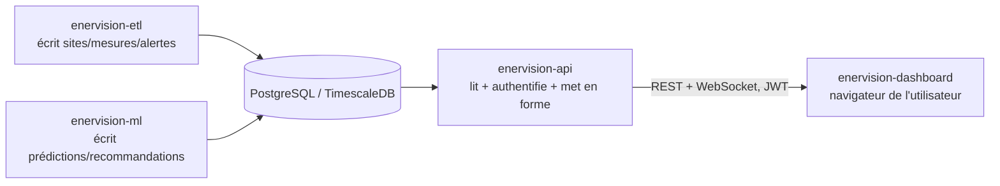

# Introduction : le rôle de l'API dans EnerVision

Ce document explique les concepts de base avant de regarder la moindre ligne de code.
Si vous connaissez déjà REST, JWT et les WebSockets, vous pouvez passer directement à
[02-architecture.md](02-architecture.md).

## Le problème que ça résout

Deux autres services du projet écrivent des données en base : `enervision-etl` (sites,
mesures, alertes) et `enervision-ml` (prédictions, recommandations). Aucun de ces deux
services ne parle au navigateur d'un utilisateur — ce ne sont ni des sites web, ni des
API publiques, ils écrivent simplement dans PostgreSQL/TimescaleDB et s'arrêtent là.

Le dashboard, lui, tourne dans le navigateur d'un utilisateur : un navigateur ne peut pas
se connecter directement à une base de données (pas de driver PostgreSQL en JavaScript
côté client, et ouvrir la base à Internet serait de toute façon une faille de sécurité
majeure). Il faut un intermédiaire qui :

- parle HTTP (ce qu'un navigateur sait faire) ;
- vérifie qui a le droit de lire quoi (une base de données n'a pas de notion
  d'utilisateur "dashboard") ;
- met en forme la donnée pour qu'elle soit directement exploitable côté client (pagination,
  tri, filtres) plutôt que de renvoyer des lignes SQL brutes.

C'est exactement le rôle d'`enervision-api`.

*L'API ne produit aucune donnée métier elle-même : elle est en lecture seule sur des
tables dont elle n'est pas propriétaire (voir [03-modele-de-donnees.md](03-modele-de-donnees.md)).*

## Vocabulaire de base

- **REST** : un style d'API où chaque ressource (un site, une mesure, une alerte...) est
  accessible par une URL (`GET /api/v1/sites`), et où le verbe HTTP (`GET`, `POST`)
  indique l'action. C'est le mode d'échange "classique" : le client demande, le serveur
  répond, la connexion se referme.
- **JWT (JSON Web Token)** : un jeton signé, opaque pour le client, qui prouve qu'un
  utilisateur s'est authentifié avec succès il y a peu. Le client le renvoie à chaque
  requête (`Authorization: Bearer <token>`), le serveur vérifie sa signature — sans avoir
  besoin de retenir un état de session côté serveur.
- **CORS (Cross-Origin Resource Sharing)** : un mécanisme de sécurité **du navigateur**
  (pas du serveur) qui bloque par défaut un appel JavaScript vers une autre origine
  (protocole+hôte+port) que celle de la page. Le dashboard et l'API tournant sur des
  ports différents, chaque appel du dashboard est une requête "cross-origin" : sans
  configuration CORS explicite côté API, le navigateur les bloquerait toutes avant même
  qu'elles n'atteignent le serveur.
- **WebSocket** : contrairement à REST, une connexion **persistante** entre client et
  serveur, dans les deux sens, plutôt qu'une requête-réponse qui se referme aussitôt.
  Utile ici pour pousser une mesure ou une alerte au dashboard dès qu'elle apparaît en
  base, sans que le navigateur ait à redemander "y a-t-il du nouveau ?" en boucle.
- **Pagination** : découper une réponse potentiellement longue (des milliers d'alertes)
  en pages numérotées (`page`, `limit`), pour que le client ne charge et n'affiche que ce
  dont il a besoin à l'instant présent.

## Ce que l'API n'est pas

Un point important à garder en tête pour la suite de cette documentation : l'API **ne
crée aucune des tables qu'elle lit**, et **n'écrit jamais de donnée métier**. Les tables
(`site`, `measure_raw`, `alert`, `prediction`, `recommendation`) sont créées par le
script d'initialisation SQL d'`enervision-devops`
(`db/init/002_create_tables.sql`) ; l'API se contente de définir des modèles SQLAlchemy
qui décrivent ce schéma existant, pour pouvoir le lire (voir
[03-modele-de-donnees.md](03-modele-de-donnees.md)). Cette séparation évite qu'un
service applicatif ne modifie par erreur un schéma dont un autre service dépend.

Muni de ce vocabulaire, vous pouvez passer à [02-architecture.md](02-architecture.md)
pour voir comment le code est organisé.
