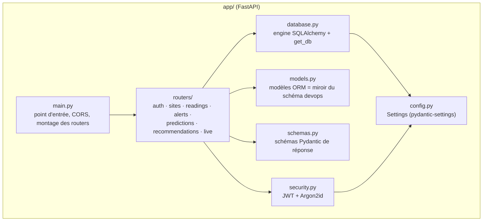

# Architecture du code

## Vue d'ensemble



`main.py` ne fait que trois choses : construire l'application FastAPI, configurer CORS,
et monter les sept routers. Toute la logique métier vit dans `routers/`.

## Un routeur, une ressource

Chaque fichier de `routers/` correspond à une famille de routes, préfixée
(`/api/v1/sites`, `/api/v1/alerts`...) et taguée pour la documentation interactive
(`/docs`) :

| Router | Préfixe | Rôle |
|---|---|---|
| `auth.py` | `/auth` | `POST /auth/login` — authentification, émet un JWT |
| `sites.py` | `/api/v1/sites` | Liste et détail des sites |
| `readings.py` | `/api/v1/readings` | Historique des mesures, avec fenêtrage temporel |
| `alerts.py` | `/api/v1/alerts` | Alertes paginées/triées/filtrées + résumé par sévérité |
| `predictions.py` | `/api/v1/predictions` | Prédictions du service ML |
| `recommendations.py` | `/api/v1/recommendations` | Recommandations d'actions correctives |
| `live.py` | `/ws/*` | Les deux WebSockets temps réel |

Toutes les routes `/api/v1/*` (et les deux WebSockets) exigent une preuve
d'authentification — voir [06-securite.md](06-securite.md). `GET /health` est la seule
route non protégée : Docker doit pouvoir l'interroger pour son healthcheck sans jeton.

## Pourquoi CORS est explicite, pas `allow_origins=["*"]`

Le dashboard (SPA statique servie par nginx) et l'API tournent toujours sur des ports
différents — même en local (`5173` vs `3000`), et en production le dashboard est servi
par un conteneur distinct de l'API. Le navigateur les traite donc toujours comme deux
origines différentes : sans middleware CORS explicite, le tout premier appel du
dashboard (`POST /auth/login`) serait bloqué par le navigateur avant même d'atteindre
l'API.

```python
app.add_middleware(
    CORSMiddleware,
    allow_origins=settings.cors_allowed_origins_list,
    allow_credentials=False,
    allow_methods=["GET", "POST", "OPTIONS"],
    allow_headers=["Authorization", "Content-Type"],
)
```

Deux détails de ce middleware valent d'être compris :

- **Liste explicite d'origines plutôt que `"*"`** : ça documente ce dont l'API a
  réellement besoin (principe de moindre privilège), mais ça ne change rien à la
  sécurité *réelle* du serveur — CORS protège le navigateur du client contre un site
  malveillant qui essaierait d'appeler l'API à l'insu de l'utilisateur, ce n'est **pas**
  un mécanisme d'authentification. La protection réelle de chaque route reste le JWT
  (`Depends(get_current_subject)`), indépendamment de ces en-têtes.
- **`allow_credentials=False`** : l'authentification passe par un header
  `Authorization: Bearer <token>` (le JWT est stocké en `localStorage` côté dashboard),
  jamais par un cookie. CORS n'a donc pas besoin d'autoriser l'envoi de cookies
  cross-origin.

`CORSMiddleware` ne protège que les routes HTTP classiques — les deux routes WebSocket
de `live.py` **doivent revalider l'origine elles-mêmes** (voir
[05-temps-reel-websocket.md](05-temps-reel-websocket.md)).

## Suite

- [03-modele-de-donnees.md](03-modele-de-donnees.md) — les tables lues par l'API.
- [04-routes-rest.md](04-routes-rest.md) — le détail de chaque route.
