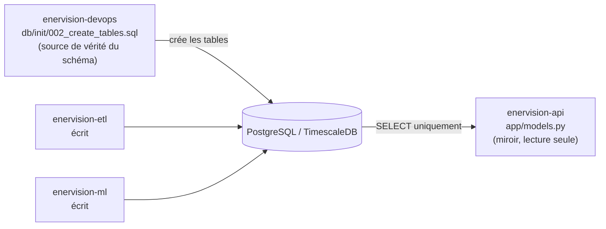

# Le modèle de données : ce que l'API lit

## L'API ne possède aucune table

C'est le point le plus important à comprendre avant de lire `models.py`. Les cinq tables
(`site`, `measure_raw`, `alert`, `prediction`, `recommendation`) sont créées par
`enervision-devops/db/init/002_create_tables.sql`, à partir du modèle conceptuel de
données (MCD) du projet. `enervision-etl` et `enervision-ml` y écrivent ; l'API n'y
écrit **jamais** — elle ne fait que lire.

`app/models.py` définit donc des modèles SQLAlchemy qui sont un **miroir** de ce schéma
existant, pas sa source de vérité. Aucun `Base.metadata.create_all()` n'est appelé en
dehors des tests : en production, si les modèles Python et le schéma SQL divergeaient,
c'est le schéma SQL qui ferait foi et l'API échouerait bruyamment (colonne manquante),
plutôt que de silencieusement créer un schéma parallèle incohérent.



## Les cinq tables

| Table | Écrite par | Nature |
|---|---|---|
| `site` | `enervision-etl` | État courant (remplacé, jamais un historique) |
| `measure_raw` | `enervision-etl` (consumer de persistance) | Fait immuable, hypertable TimescaleDB |
| `alert` | `enervision-etl` (consumer d'alerting) | Fait immuable, hypertable |
| `prediction` | `enervision-ml` | Fait immuable, hypertable |
| `recommendation` | `enervision-ml` | Fait immuable, hypertable |

Les quatre dernières sont des **hypertables** TimescaleDB, partitionnées sur leur colonne
`timestamp` — c'est pour cette raison que leurs clés primaires sont composites
(`(id, timestamp)`) : TimescaleDB impose que la clé primaire d'une hypertable inclue sa
colonne de partitionnement.

**Limite connue, héritée du schéma** : TimescaleDB ne permet pas de contrainte `FOREIGN
KEY` classique entre deux hypertables (la table référencée devrait avoir une contrainte
`UNIQUE` sur la seule colonne `id`, ce qu'une hypertable ne peut pas garantir). Le lien
`recommendation.prediction_id → prediction.prediction_id` n'est donc pas une vraie
contrainte de clé étrangère, juste un champ indexé — `app/models.py` le reflète
fidèlement (`prediction_id: Mapped[uuid.UUID | None] = mapped_column(Uuid(as_uuid=True))`,
sans `ForeignKey`).

## Deux adaptations pour que les tests tournent sans base externe

Les tests unitaires de l'API (voir
[09-tests-et-qualite.md](09-tests-et-qualite.md)) tournent sur une base **SQLite en
mémoire**, pas sur un vrai PostgreSQL — pour rester rapides et ne dépendre d'aucune
infrastructure. Deux types SQLAlchemy sur mesure comblent l'écart de comportement entre
les deux moteurs, pour que le code applicatif se comporte **identiquement** en test et en
production :

### `_STRING_ARRAY` — un tableau de chaînes portable

```python
_STRING_ARRAY = ARRAY(String).with_variant(JSON(), "sqlite")
```

Postgres a un vrai type tableau natif (utilisé pour `measure_raw.null_reasons`) ; SQLite
n'en a pas. `with_variant` bascule automatiquement sur du JSON pour SQLite, qui
(dé)sérialise vers/depuis `list[str]` de façon transparente côté Python — le code
applicatif ne voit jamais la différence.

### `_UtcTimestamp` — garantir un datetime *aware*, même sur SQLite

```python
class _UtcTimestamp(TypeDecorator):
    impl = TIMESTAMP(timezone=True)

    def process_result_value(self, value, dialect):
        if value is not None and value.tzinfo is None:
            value = value.replace(tzinfo=UTC)
        return value
```

Une colonne `TIMESTAMP(timezone=True)` renvoie, sur Postgres, un `datetime` *aware*
(qui porte son fuseau). SQLite, lui, ne stocke aucune information de fuseau et rend
systématiquement un `datetime` *naïf* — sans ce correctif, la même comparaison de dates
ou la même sérialisation JSON (avec son suffixe `Z`) se comporterait différemment selon
qu'on est en test (SQLite) ou en production (Postgres), exactement le genre d'écart
qu'une suite de tests est censée exclure plutôt que masquer.

## Des schémas Pydantic distincts des modèles ORM

`app/schemas.py` définit une classe `*Out` par ressource (`SiteOut`, `ReadingOut`,
`AlertOut`...), avec `model_config = ConfigDict(from_attributes=True)` : ça permet de
construire un schéma de réponse directement à partir d'une instance ORM
(`AlertOut.model_validate(alert_orm_instance)`), sans dupliquer manuellement chaque
champ.

Séparer strictement les schémas ORM (`models.py`) des schémas de réponse (`schemas.py`)
a un intérêt de sécurité et de stabilité : un champ ajouté au modèle ORM (pour un usage
interne) n'est jamais exposé côté API par accident, seuls les champs explicitement
déclarés dans le schéma `Out` correspondant apparaissent dans la réponse JSON.

Deux enveloppes de pagination existent, avec la même forme
(`{items, total, page, limit}`) : `AlertPage` et `RecommendationPage`. Elles sont
délibérément dupliquées plutôt qu'unifiées en un seul type générique, pour que le
dashboard n'ait à connaître qu'un seul format de réponse paginée des deux côtés — voir
[04-routes-rest.md](04-routes-rest.md).

## Suite

- [04-routes-rest.md](04-routes-rest.md) — comment ces modèles sont exposés route par
  route.
