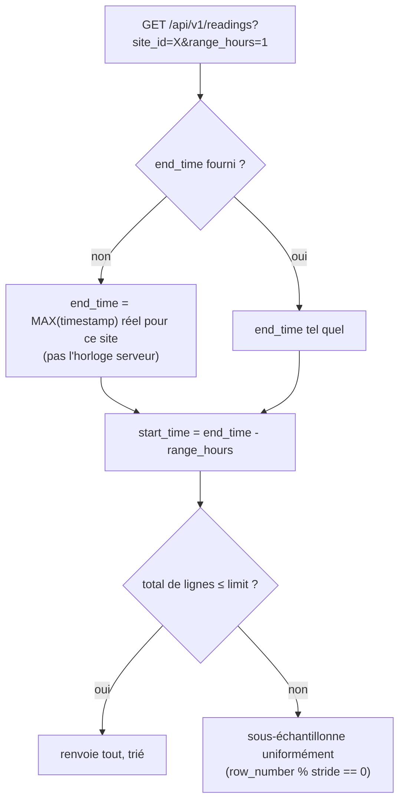

# Les routes REST en détail

Toutes les routes ci-dessous, sauf `/health` et `POST /auth/login`, exigent
`Authorization: Bearer <token>` (voir [06-securite.md](06-securite.md)).

## `POST /auth/login`

Reçoit un formulaire OAuth2 standard (`username`/`password`, encodé en
`application/x-www-form-urlencoded` — **pas** du JSON, c'est le contrat imposé par
`OAuth2PasswordRequestForm` de FastAPI), vérifie les identifiants contre le compte de
service unique défini en configuration, et renvoie `{access_token, token_type: "bearer"}`.
Voir [06-securite.md](06-securite.md) pour le détail de la vérification.

## `GET /api/v1/sites` et `GET /api/v1/sites/{site_id}`

Les routes les plus simples du projet : pas de pagination (le nombre de sites reste
petit), pas de filtre. `get_site` renvoie une 404 explicite si l'identifiant n'existe
pas, plutôt qu'une liste vide qui laisserait penser à une erreur de requête.

## `GET /api/v1/readings`

Historique des mesures, avec un mécanisme de fenêtrage temporel pensé pour un usage
dashboard :

- **`range_hours`** (ex. `24`) plutôt que des dates absolues : "les N dernières heures
  de données", **ancré sur `max(timestamp)` réellement en base**, pas sur l'horloge du
  serveur. Un léger retard d'ingestion (l'ETL en différé de quelques minutes, des
  horloges pas parfaitement synchronisées entre le pipeline et l'API) suffisait sinon à
  rendre les fenêtres courtes (1h, 6h) totalement vides — la période demandée
  `[maintenant-1h, maintenant]` ne recoupait alors aucune donnée réelle, alors qu'une
  fenêtre large (24h) absorbait ce retard sans que ça se voie. Avec cet ancrage, "la
  dernière heure" veut dire "la dernière heure de données qui existent", pas "la
  dernière heure d'horloge murale".
- **`start_time`/`end_time`** restent disponibles pour un filtrage par dates absolues
  (utilisé par le dashboard pour une plage personnalisée, ou pour étendre une fenêtre
  déjà chargée en glissant sur un graphique — voir le dashboard,
  `04-donnees-et-graphiques.md`).
- **Sous-échantillonnage uniforme** si le nombre de lignes dépasse `limit` : plutôt que
  de garder les `limit` lignes les plus récentes (ce qui masquerait tout le début de la
  période demandée dès que le rythme d'ingestion est élevé — "7 jours" ne montrant en
  réalité qu'une poignée d'heures récentes), l'API prend un point tous les `stride`
  lignes (`stride = ceil(total / limit)`) via une fenêtre `row_number()` — technique
  portable à SQLite pour les tests, contrairement à `TABLESAMPLE`.

## `GET /api/v1/alerts` et `GET /api/v1/alerts/summary`

`list_alerts` répond une **enveloppe paginée** `{items, total, page, limit}` — le
dashboard a besoin de `total` pour calculer le nombre de pages, ce qu'une simple liste ne
permettrait pas de déduire sans tout charger. Filtrable (`site_id`, `severity`,
`start_time`, `end_time`) et triable (`sort_by`, `order`), avec une **whitelist
explicite** de colonnes triables (`SORTABLE_COLUMNS = {"timestamp": ..., "severity":
..., "site_id": ...}`) plutôt qu'un `getattr(Alert, sort_by)` dynamique — pour ne jamais
exposer un tri sur une colonne arbitraire à partir d'une simple chaîne fournie par le
client (une forme d'injection, même si SQLAlchemy protège déjà des injections SQL
classiques).

`alerts_summary` renvoie `{sévérité: nombre}` sur la période/site donnés, en une seule
requête `GROUP BY` — utilisé par les tuiles de résumé de l'accueil du dashboard, sans
avoir à paginer/charger toutes les alertes juste pour les compter.

## `GET /api/v1/predictions`

Triées par `target_timestamp` (l'horizon prédit) croissant — l'ordre attendu pour tracer
une courbe de prévision, à ne pas confondre avec `timestamp` qui est la date de
*génération* de la prédiction.

Le paramètre `latest_only` (activé par défaut) mérite une explication : le service ML
rejoue un lot de prévision à intervalle régulier (voir la documentation
`enervision-ml`), et **réécrit une nouvelle ligne pour le même créneau à chaque
passage** — l'historique des runs successifs sert à mesurer la justesse du modèle dans
le temps (`forecast_mae`), pas à être affiché tel quel. Sans ce filtre, le dashboard
afficherait toutes les prévisions successives d'un même créneau plutôt que la plus
récente. Techniquement, `latest_only` s'appuie sur `row_number() OVER (PARTITION BY
site_id, target_timestamp ORDER BY timestamp DESC)` plutôt que sur le `DISTINCT ON` de
Postgres — ce dernier n'existe que sur ce moteur (silencieusement ignoré ailleurs), la
fenêtre `row_number()` reste portable jusqu'à SQLite (tests unitaires).

## `GET /api/v1/recommendations`

Même principe de pagination/tri/filtre que `/api/v1/alerts`, avec la même forme
d'enveloppe (`RecommendationPage`) — un choix délibéré pour que le dashboard réutilise
son composant de pagination générique des deux côtés, sans avoir à connaître deux
formats de réponse différents.

## Suite

- [05-temps-reel-websocket.md](05-temps-reel-websocket.md) — le pendant temps réel de
  `/api/v1/readings` et `/api/v1/alerts`.
