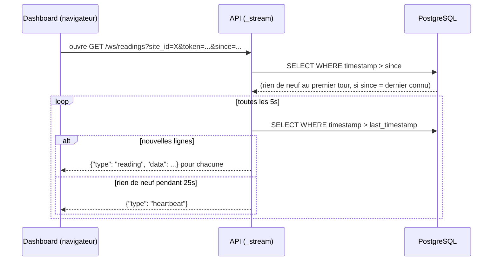
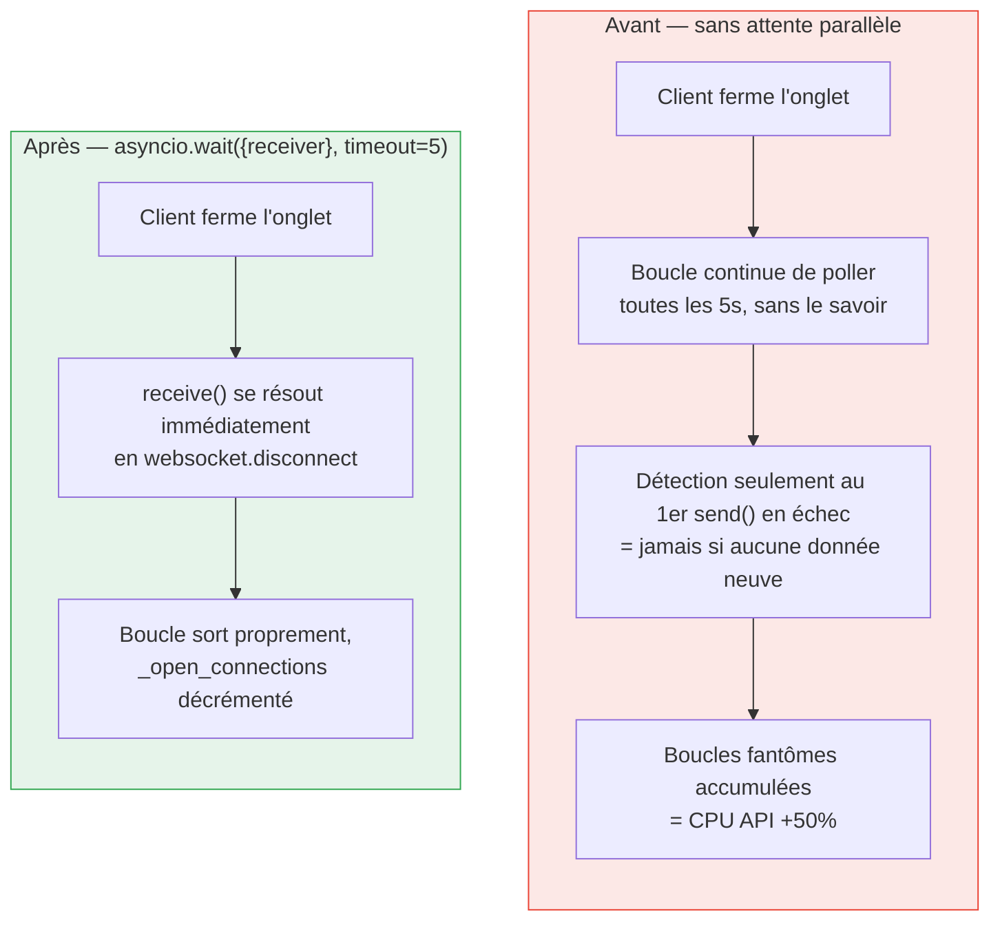

# Le temps réel : `/ws/readings` et `/ws/alerts`

C'est le module le plus subtil de l'API (`app/routers/live.py`). Ce document explique
pourquoi il existe, comment il fonctionne, et un bug de production qu'il corrige
explicitement.

## Ce n'est pas un vrai push événementiel

Point à comprendre avant tout : `enervision-etl` et `enervision-ml` **écrivent
directement en base**, sans passer par l'API — il n'existe aucun bus d'événements côté
API sur lequel se brancher pour être notifié "en vrai" d'une nouvelle ligne. Le
WebSocket ne peut donc pas être un push au sens strict : c'est un **polling interne**
côté serveur, toutes les `POLL_INTERVAL_SECONDS` (5 secondes), qui **ne pousse au client
que les lignes réellement nouvelles** depuis le dernier envoi.

Ce n'est donc pas un vrai push événementiel côté serveur, mais le client, lui, ne voit
que des messages utiles : aucun trafic tant que rien n'est nouveau — contrairement à un
ancien polling HTTP qui redemandait tout l'historique à chaque fois.

## Le contrat côté client : `since`, `heartbeat`, plafond de connexions

- **`since`** (ISO 8601, optionnel) : l'horodatage de la donnée la plus récente déjà
  chargée par le client en REST. Le flux reprend **strictement après** cette date : ni
  trou, ni rejeu. **Sans `since`, le flux démarre au dernier horodatage présent en
  base** — l'historique n'est jamais rejoué en entier au premier tour, seulement ce qui
  arrive après la connexion.
- **`{"type": "heartbeat"}`** : une trame envoyée toutes les ~25 secondes de silence,
  pour empêcher un reverse-proxy (Traefik, nginx) ou certains navigateurs de couper une
  connexion jugée inactive. Le client l'ignore simplement.
- **Fin de connexion détectée immédiatement** : le serveur attend **en parallèle** un
  message du client (`websocket.receive()`), qui se résout dès que l'onglet est fermé ou
  que la vue change côté dashboard. C'est directement lié au bug corrigé ci-dessous.
- **Plafond** : 200 connexions simultanées (`MAX_CONCURRENT_CONNECTIONS`) ; au-delà, la
  connexion est refusée avec le code WebSocket standard `1013` ("try again later"),
  plutôt que de laisser la charge grimper sans limite.

## Le bug corrigé : le conteneur d'API à +50% de CPU

Le commentaire du code (et le README du dépôt) documente un bug réel qui a orienté la
conception de `_stream` :

> Sans l'attente parallèle sur `websocket.receive()`, un client parti (onglet fermé,
> navigation vers une autre page) n'était détecté qu'au premier `send` en échec — donc
> **jamais tant qu'aucune donnée neuve n'arrivait**. La boucle de polling continuait
> d'interroger la base indéfiniment pour un client qui n'écoutait plus, et ces boucles
> fantômes s'accumulaient à chaque navigation dans le dashboard.

C'est ce comportement qui est couvert par le test
`tests/test_live.py::test_ws_stops_polling_when_client_disconnects`.

## Le point délicat : le token JWT en query string

`GET /ws/readings?...&token=...` passe le jeton en paramètre d'URL, **pas** en en-tête
`Authorization`. Ce n'est pas un oubli : un WebSocket natif ouvert depuis un navigateur
ne peut pas poser de header `Authorization` (limitation de l'API `WebSocket` du
navigateur). Le token n'apparaît donc jamais dans les journaux d'accès applicatifs
puisqu'il expire vite (`JWT_EXPIRE_MINUTES`), mais reste à garder en tête si des logs
d'accès **bruts** (au niveau du reverse-proxy) sont un jour activés — ils
contiendraient l'URL complète, token inclus.

`_origin_allowed` revalide manuellement l'en-tête `Origin` de la requête WebSocket
contre la même liste que `CORS_ALLOWED_ORIGINS` : `CORSMiddleware` (voir
[02-architecture.md](02-architecture.md)) ne protège que les routes HTTP classiques, pas
les routes WebSocket.

## `_fetch_factory` : lire "ce qui est nouveau", pas rejouer l'historique

Le point le plus facile à mal implémenter dans ce genre de mécanisme : que se
passe-t-il à la toute première connexion, sans `since` ? La version corrigée part du
**dernier horodatage réellement en base** (`_latest_timestamp`), pas de `None` — la
version précédente, elle, rejouait tout l'historique par tranches croissantes de 500
lignes en repartant des plus anciennes : à chaque connexion, le dashboard recevait des
centaines de lignes hors période affichée (graphique vide qui se remplissait par
à-coups, liste d'alertes qui semblait se recharger en boucle), et l'API rescannait
inutilement toute la table toutes les 5 secondes.

Autre détail : à chaque tour, les lignes nouvelles sont triées **décroissant** puis
limitées à `MAX_ROWS_PER_POLL` (200), pour prendre les lignes les plus **récentes** en
cas de gros retard — puis remises dans l'ordre chronologique pour l'envoi. Trier en
croissant comme une version antérieure ferait avancer le curseur d'un vieux paquet à la
fois quand le retard dépasse la limite, sans jamais rattraper le présent.

## Suite

- [06-securite.md](06-securite.md) — le détail de l'authentification JWT utilisée aussi
  bien en REST qu'en WebSocket.
