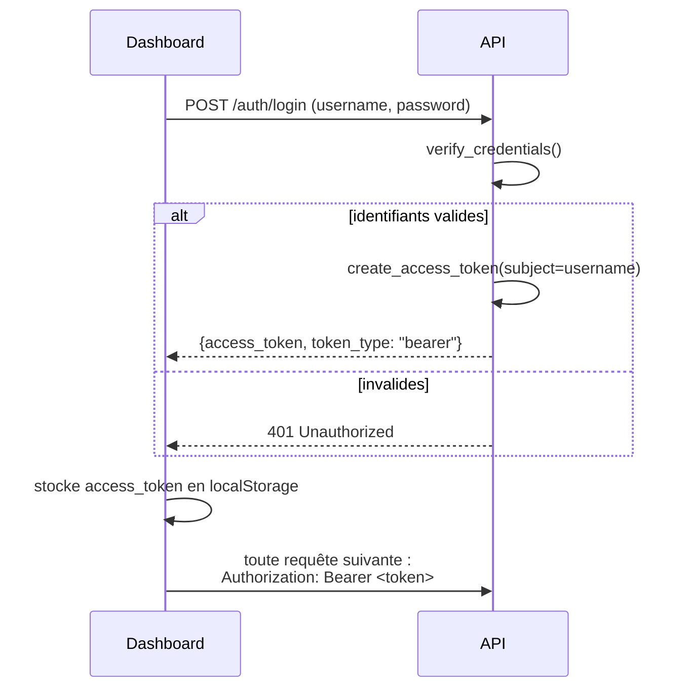

# Sécurité : authentification et secrets

## Un compte de service unique, pas une gestion multi-utilisateurs

L'API n'a **pas** de table `user` : un unique couple `API_USERNAME`/`API_PASSWORD_HASH`,
défini en configuration, sert de compte de service pour tout le dashboard. C'est un
choix assumé et documenté (`.env.example` le dit explicitement) : "à remplacer par une
vraie gestion utilisateurs si le sujet l'exige". Pour la portée du projet, un compte
partagé suffit à protéger l'accès aux données sans construire un système d'inscription/
gestion de rôles inutile ici.

## `POST /auth/login` → JWT



`verify_credentials` compare le nom d'utilisateur reçu à `settings.api_username`, puis
vérifie le mot de passe avec `password_hasher.verify(settings.api_password_hash,
password)` — jamais de comparaison de mot de passe en clair.

`create_access_token` encode un payload minimal (`{"sub": subject, "exp": expire}`)
signé avec `JWT_SECRET_KEY` (algorithme `HS256` par défaut), avec une expiration
(`JWT_EXPIRE_MINUTES`, 60 par défaut). Le jeton est **opaque** pour le client : il ne
sert qu'à être renvoyé tel quel, sa validité est vérifiée uniquement côté serveur.

`get_current_subject` (utilisée comme dépendance FastAPI sur chaque route protégée,
`Depends(get_current_subject)`) décode et valide la signature/expiration du jeton ; toute
erreur (signature invalide, jeton expiré, `sub` absent) remonte comme un `401` générique
— la cause exacte n'a pas à être révélée à l'appelant (`raise credentials_exception from
None`, pour ne pas non plus divulguer d'information via la chaîne d'exception Python).

## Argon2id plutôt que bcrypt

```python
password_hasher = PasswordHasher()  # argon2-cffi, paramètres par défaut :
                                     # time_cost=3, memory_cost=64 Mo, parallelism=4
```

Argon2id est l'algorithme de hachage de mot de passe recommandé par l'OWASP — il
remplace des choix plus anciens comme `passlib`/`bcrypt`. `API_PASSWORD_HASH` (la valeur
stockée en configuration) est ce hash Argon2id, **jamais** le mot de passe en clair. Pour
le générer :

```bash
python -c "from app.security import hash_password; print(hash_password('mon_mdp'))"
```

## Secrets : jamais commités, injectés par environnement

`.env` n'est jamais versionné (voir `.gitignore`). En local, il contient des valeurs de
développement ; en déploiement, ces mêmes variables (`JWT_SECRET_KEY`, `API_USERNAME`,
`API_PASSWORD_HASH`, `DATABASE_URL`...) viennent du secret GitHub `ENV_FILE_CONTENTS` de
l'environnement ciblé (`onprem-dev` / `onprem-prod` — un secret **distinct** par stage,
avec des valeurs distinctes). Voir
[08-deploiement-et-flux-devops.md](08-deploiement-et-flux-devops.md) pour le détail du
mécanisme d'injection.

## `CORS_ALLOWED_ORIGINS`

Doit être l'URL **exacte** (protocole + hôte + port) depuis laquelle le dashboard est
servi. En déploiement, doit correspondre à `API_URL`/`DASHBOARD_PORT` du même
environnement (voir `enervision-devops/envs/onprem.env.example`) : un décalage ici se
traduit par un blocage CORS silencieux côté navigateur — le dashboard semble "ne rien
charger", sans qu'aucune erreur explicite n'apparaisse côté serveur (voir
[02-architecture.md](02-architecture.md) pour ce que CORS protège réellement).

## Suite

- [07-configuration.md](07-configuration.md) — le détail de chaque variable de config.
