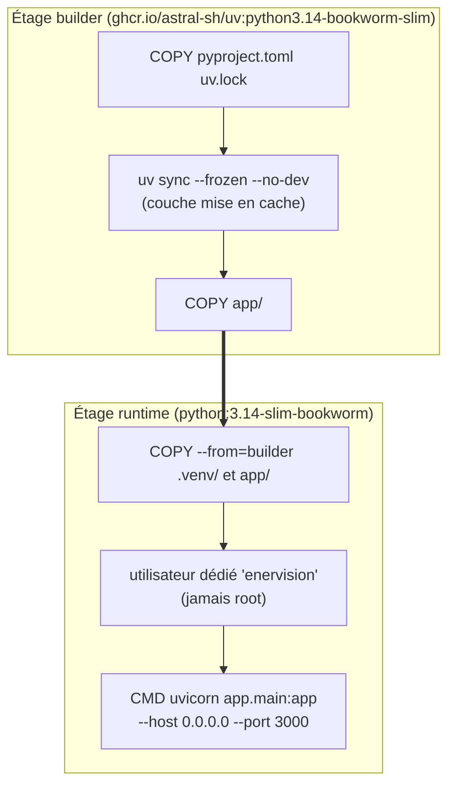
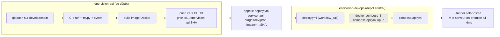
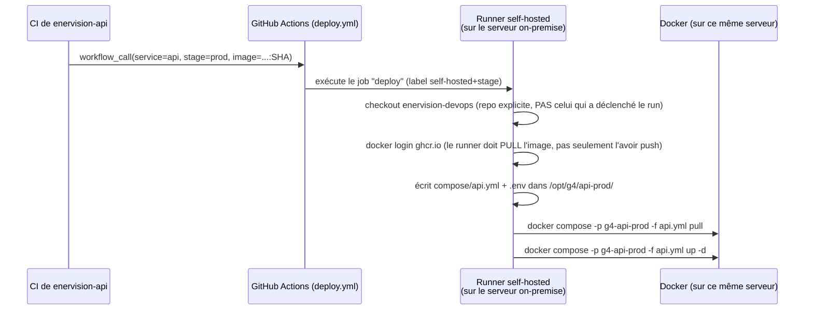

# Déploiement et flux devops

Ce document raconte le trajet complet d'un changement de code jusqu'au conteneur qui
tourne réellement, et le rôle exact que joue `enervision-devops` dans ce trajet.
`enervision-api` ne sait **pas se déployer elle-même** — comme `enervision-etl` et
`enervision-ml`, elle délègue tout le mécanisme de déploiement à un dépôt central.

## L'image Docker : deux étages



Mêmes principes que `enervision-etl`/`enervision-consumer` : les dépendances sont
installées **avant** de copier le code source (`COPY pyproject.toml uv.lock` précède
`COPY app`), pour que la couche `uv sync` ne soit reconstruite que si `uv.lock` change —
pas à chaque modification d'un fichier Python. L'étage final ne contient ni `uv` ni
chaîne de compilation : `psycopg[binary]` embarque déjà `libpq`, il n'y a rien à
compiler. Le processus tourne sous un utilisateur dédié (`enervision`), jamais `root` —
limite l'impact d'un éventuel processus compromis dans le conteneur.

## `enervision-devops` : le dépôt qui sait déployer

Aucun des dépôts de service (`api`, `dashboard`, `etl`, `ml`) ne contient de logique de
déploiement propre. Chacun :

1. build sa propre image Docker et la pousse sur le registre (`ghcr.io/enervision-g4/enervision-api:<sha>`) ;
2. appelle ensuite un **workflow réutilisable** (`workflow_call`) défini dans
   `enervision-devops/.github/workflows/deploy.yml`, en lui passant le nom du service,
   l'environnement cible (`dev`/`prod`) et le tag d'image exact à déployer.



Pourquoi centraliser ainsi plutôt que de dupliquer la logique de déploiement dans chaque
dépôt de service : le mécanisme (SSH implicite via runner self-hosted, structure des
dossiers sur le serveur, gestion du réseau Docker partagé) ne change jamais d'un service
à l'autre — seuls le nom du service et le fichier `compose/<service>.yml` diffèrent.
Une évolution du mécanisme de déploiement (ex. changer la stratégie de rolling update) se
fait donc en un seul endroit, jamais quatre fois.

## `compose/api.yml`

```yaml
services:
  api:
    image: ${IMAGE}
    container_name: g4_api_${STAGE}
    environment:
      DATABASE_URL: ${DATABASE_URL}
      JWT_SECRET_KEY: ${JWT_SECRET_KEY}
      # ...
    ports:
      - "${API_PORT}:3000"
    networks:
      - g4_net
```

Trois points à retenir :

- **`${IMAGE}` et `${STAGE}` ne viennent pas du `.env` de l'environnement**, mais sont
  injectés par le workflow de déploiement lui-même au moment de l'exécution (voir plus
  bas) — c'est ce qui permet au même fichier compose de servir aussi bien `dev` que
  `prod` sur le même hôte, sans collision de nom de conteneur.
- **`ports: "${API_PORT}:3000"`** : l'API est exposée directement sur un port hôte (pas
  de reverse-proxy Traefik ici, celui du serveur appartenant à un autre groupe du même
  établissement) — `API_PORT` diffère entre `dev` et `prod` pour éviter que les deux
  n'entrent en collision sur le même hôte Docker.
- **`networks: g4_net`** : réseau Docker partagé par tous les services EnerVision
  (API, dashboard, base, Kafka...), créé une fois par environnement
  (`scripts/bootstrap-network.sh` côté devops). C'est ce qui permet à l'API de résoudre
  `g4_db_dev`/`g4_db_prod` par leur nom DNS interne plutôt que par une IP.

## Le déploiement pas à pas (`deploy.yml`)



Quelques détails du workflow qui ne sont pas évidents à la première lecture :

- **Le serveur on-premise n'est joignable que depuis le réseau de l'établissement** : un
  runner GitHub hébergé (`ubuntu-latest`) ne peut pas s'y connecter en SSH. Le job
  s'exécute donc directement sur un **runner self-hosted**, installé sur ce serveur — pas
  de connexion SSH distante à gérer, le "déploiement" est une exécution locale.
- **`dev` et `prod` tournent sur le même hôte Docker.** Sans distinction, deux
  déploiements successifs entreraient en collision sur les mêmes noms de ressources.
  `stage` sert donc à la fois à choisir le runner (label `dev`/`prod`) et à suffixer tout
  ce qui pourrait collisionner : le dossier sur le serveur
  (`/opt/g4/api-dev/` vs `/opt/g4/api-prod/`), le nom du conteneur
  (`container_name: g4_api_${STAGE}`), et le **projet** Compose
  (`-p g4-api-${STAGE}`, indispensable car `compose/api.yml` déclare un `name:` fixe —
  sans `-p` explicite, Compose traiterait `dev` et `prod` comme le même projet et
  remplacerait le conteneur de l'un par celui de l'autre).
- **Le secret `ENV_FILE_CONTENTS`** (un par environnement GitHub `onprem-dev` /
  `onprem-prod`) est écrit tel quel dans le `.env` du service sur le serveur, puis
  `IMAGE` et `STAGE` y sont ajoutés par le workflow — c'est ce `.env` complet que
  `docker compose` lit ensuite.

## Secrets : jamais commités, un secret GitHub par environnement

`enervision-api` ne committe jamais de secret réel : `.env.example` documente les
variables attendues, `.env` (les vraies valeurs de dev local) est ignoré par git. En
déploiement, ces mêmes variables viennent du secret GitHub `ENV_FILE_CONTENTS`, défini
**séparément** pour l'environnement `onprem-dev` et `onprem-prod` (Settings →
Environments du dépôt) — avec des valeurs distinctes (mots de passe, clé JWT, port) entre
les deux stages, pour qu'une fuite ou une erreur de configuration en dev n'expose jamais
la prod.

## Suite

- [09-tests-et-qualite.md](09-tests-et-qualite.md) — ce que la CI vérifie avant qu'une
  image ne soit même construite.
